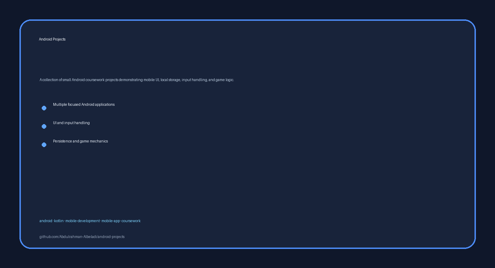

# Android Projects

<!-- employer-visual:start -->

  

<!-- employer-visual:end -->

A collection of small Android coursework projects demonstrating mobile UI, local storage, input handling, and game logic.

**Technologies:** Kotlin · Android

## Highlights

- Multiple focused applications rather than one monolithic codebase.
- Examples involving input validation, persistence, UI state, and game mechanics.
- Title-based project folders for quick employer review.

## Projects

| Project | Location |
|---|---|
| Encryption Tool | [`projects/encryption-tool`](projects/encryption-tool) |
| Color Sequence Game | [`projects/color-sequence-game`](projects/color-sequence-game) |
| Mortgage Calculator | [`projects/mortgage-calculator`](projects/mortgage-calculator) |
| Pong Game | [`projects/pong-game`](projects/pong-game) |
| File Read and Write | [`projects/file-read-write`](projects/file-read-write) |
| Balloon Game | [`projects/balloon-game`](projects/balloon-game) |

## Getting started

1. Open the selected project in Android Studio.
2. Review its source layout and Android SDK assumptions.
3. Some source-only exercises may require creating a small wrapper project to run.

## Portfolio note

These are coursework snapshots with different levels of completeness and toolchain requirements.

## License and attribution

Use and redistribution are governed by the repository's [`LICENSE`](LICENSE).
